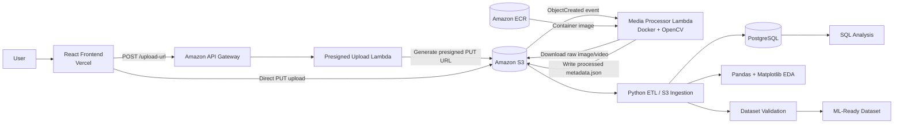
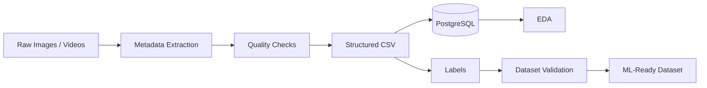

# SentinelVision

SentinelVision is a cloud-native media data engineering platform for ingesting, processing, validating, and preparing image and video datasets for machine learning workflows.

The project combines **React, Amazon API Gateway, AWS Lambda, Amazon S3, Amazon ECR, Docker, OpenCV, PostgreSQL, Pandas, Matplotlib, and Python** to demonstrate an end-to-end pipeline from raw media upload to structured, ML-ready metadata.

> Live application: https://sentinelvision-mauve.vercel.app/

---

## Overview

SentinelVision was designed to solve a common data engineering problem in computer vision systems:

**How do we reliably ingest large volumes of unstructured image and video data, extract useful metadata, assess data quality, structure the results, and prepare the dataset for downstream machine learning?**

The platform supports:

- Direct browser uploads of image and video files
- Presigned Amazon S3 uploads
- Event-driven serverless media processing
- OpenCV-based image and video analysis
- Structured metadata generation
- Image quality checks
- Dataset validation
- PostgreSQL ingestion
- SQL-based analysis
- Exploratory data analysis with Pandas and Matplotlib
- ML-ready label and dataset preparation
- Automated tests
- Reproducible local and cloud workflows

---

# Architecture



---

## Cloud Processing Flow

```text
User
  |
  v
React Frontend
  |
  | POST /upload-url
  v
API Gateway
  |
  v
Presigned Upload Lambda
  |
  | returns temporary S3 PUT URL
  v
Browser uploads directly to S3
  |
  v
datasets/<dataset-id>/raw/images/
or
datasets/<dataset-id>/raw/videos/
  |
  | S3 ObjectCreated event
  v
Container Lambda
  |
  | Docker + OpenCV
  | image/video metadata extraction
  | quality analysis
  v
datasets/<dataset-id>/processed/metadata.json
```

This architecture avoids routing large media files through API Gateway or Lambda request payloads. Instead, the frontend uploads directly to Amazon S3 using a short-lived presigned URL.

---

# Key Features

## 1. Direct-to-S3 Media Upload

The frontend requests a presigned upload URL from the backend.

The browser then uploads the media file directly to S3.

This architecture provides:

- Reduced backend bandwidth
- Better scalability for large media files
- Lower API payload overhead
- Private S3 storage
- Temporary and controlled upload access

Supported media includes:

- JPG
- JPEG
- PNG
- AVIF
- MP4

---

## 2. Event-Driven AWS Processing

When a new object is uploaded under:

```text
datasets/<dataset-id>/raw/
```

Amazon S3 automatically invokes the media-processing Lambda.

The Lambda:

1. Receives the S3 event
2. Downloads the media file to temporary Lambda storage
3. Detects whether the object is an image or video
4. Runs OpenCV analysis
5. Generates structured JSON metadata
6. Writes the processed result back to S3
7. Removes the temporary local file

Processed output is stored under:

```text
datasets/<dataset-id>/processed/metadata.json
```

---

## 3. OpenCV Image Analysis

For uploaded images, SentinelVision extracts:

- Width
- Height
- Number of channels
- Mean brightness
- Brightness classification
- Laplacian variance
- Blur classification

Example:

```json
{
  "width": 5692,
  "height": 3787,
  "channels": 3,
  "brightness": 95.64,
  "brightness_status": "normal",
  "blur_score": 415.28,
  "is_blurry": false
}
```

Blur detection uses the variance of the Laplacian, providing a simple and practical computer-vision quality check.

---

## 4. Video Metadata Extraction

For uploaded videos, the processing pipeline extracts:

- Width
- Height
- Frames per second
- Frame count
- Duration

This allows image and video datasets to share a common structured metadata pipeline.

---

## 5. Recursive Event Protection

The S3 trigger monitors the `datasets/` prefix.

Because the Lambda also writes output under that prefix, the generated metadata file can trigger a second invocation.

SentinelVision explicitly detects processed objects:

```text
/processed/
```

and immediately ignores them.

This prevents recursive processing loops while keeping the bucket notification configuration simple.

---

# AWS Architecture

SentinelVision currently uses the following AWS services.

| Service | Purpose |
|---|---|
| Amazon S3 | Raw and processed media storage |
| AWS Lambda | Presigned URL generation and media processing |
| Amazon API Gateway | Public upload API |
| Amazon ECR | Docker container registry |
| Amazon CloudWatch | Lambda logging and execution monitoring |
| AWS IAM | Least-privilege access control |

---

## S3 Object Structure

```text
sentinelvision-krishnakanth-2026/
└── datasets/
    └── <dataset-id>/
        ├── raw/
        │   ├── images/
        │   │   └── <image-file>
        │   └── videos/
        │       └── <video-file>
        │
        └── processed/
            └── metadata.json
```

Each upload receives its own dataset identifier, allowing raw media and processed metadata to remain isolated and traceable.

---

# Containerized Lambda Processing

The media processor is packaged as an AWS Lambda container image.

```text
lambda/media-processor/
├── Dockerfile
└── lambda_function.py
```

The image is built locally and pushed to Amazon ECR.

Example workflow:

```bash
docker build --platform linux/amd64 \
  -t sentinelvision-media-processor .
```

```bash
docker tag sentinelvision-media-processor:latest \
  <aws-account-id>.dkr.ecr.ap-southeast-2.amazonaws.com/sentinelvision-media-processor:latest
```

```bash
docker push \
  <aws-account-id>.dkr.ecr.ap-southeast-2.amazonaws.com/sentinelvision-media-processor:latest
```

The explicit `linux/amd64` platform ensures compatibility with the Lambda function's `x86_64` architecture.

---

# Local Data Engineering Pipeline

SentinelVision also includes a reproducible Python pipeline for local ingestion, storage, validation, and analysis.



---

# PostgreSQL Integration

Structured image and video metadata can be loaded into PostgreSQL.

The database layer demonstrates:

- Schema creation
- Idempotent ingestion
- Duplicate prevention
- Structured media metadata
- SQL filtering
- Aggregation
- Dataset inspection
- Repeatable data loading

This provides a relational representation of otherwise unstructured media datasets.

---

# Exploratory Data Analysis

SentinelVision uses:

- Pandas
- Matplotlib

to inspect dataset quality and characteristics.

Analysis includes:

- Image dimensions
- Brightness distributions
- Blur scores
- Image quality issues
- Video duration
- Dataset coverage
- Label distribution
- Unknown label detection

The purpose of this stage is to identify quality gaps before model training.

---

# Dataset Validation

The validation layer checks whether the dataset is suitable for downstream ML workflows.

Examples of validation issues include:

- Blurry images
- Missing labels
- Unknown labels
- Invalid metadata
- Missing files
- Inconsistent structured records

Validation produces clear issue counts that can be reviewed before training.

---

# ML-Ready Preparation

SentinelVision prepares structured records that can be used by future computer-vision models.

The platform demonstrates:

- Image metadata standardization
- Video metadata standardization
- Label management
- Dataset balance inspection
- Quality filtering
- Validation
- Traceable raw-to-processed transformations

---

# Backend API

The local FastAPI backend includes endpoints such as:

```text
GET  /
GET  /health
POST /upload/image
POST /upload/video
GET  /datasets
GET  /datasets/{dataset_id}
```

The cloud deployment uses a serverless direct-upload architecture for large files.

---

# Frontend

The user interface is built with:

- React
- Vite
- JavaScript
- CSS

and deployed on Vercel.

The frontend allows users to select and upload media while the backend handles presigned upload generation and AWS processing.

---

# Project Structure

```text
sentinelvision/
├── data/
│   ├── raw/
│   ├── staging/
│   ├── processed/
│   ├── labels/
│   └── api_uploads/
│
├── frontend/
│   ├── public/
│   └── src/
│
├── lambda/
│   └── media-processor/
│       ├── Dockerfile
│       └── lambda_function.py
│
├── logs/
├── reports/
│   └── figures/
│
├── sql/
├── src/
│   ├── api.py
│   ├── dataset_validation.py
│   ├── image_eda.py
│   ├── image_metadata.py
│   ├── load_to_postgres.py
│   ├── load_videos_to_postgres.py
│   ├── pipeline.py
│   ├── s3_ingestion.py
│   ├── s3_storage.py
│   └── video_metadata.py
│
├── tests/
├── README.md
└── requirements.txt
```

---

# Technology Stack

### Languages

- Python
- JavaScript
- SQL

### Data Engineering

- Pandas
- PostgreSQL
- SQLAlchemy
- psycopg2
- Amazon S3
- Boto3

### Computer Vision

- OpenCV

### Cloud

- AWS Lambda
- Amazon S3
- Amazon ECR
- Amazon API Gateway
- AWS IAM
- Amazon CloudWatch

### Backend

- FastAPI

### Frontend

- React
- Vite
- Vercel

### DevOps

- Docker
- Git
- GitHub

### Testing

- pytest

### Visualization

- Matplotlib

---

# Engineering Decisions

## Why Presigned S3 Uploads?

Large image and video uploads should not be proxied unnecessarily through the application backend.

Presigned URLs allow the browser to upload directly to private S3 storage while keeping credentials hidden from users.

---

## Why Containerized Lambda?

OpenCV and its native dependencies are significantly easier to package reproducibly using Docker.

The container approach provides:

- Dependency isolation
- Reproducible builds
- Easier OpenCV packaging
- Consistent Lambda runtime behavior
- ECR-based deployment

---

## Why Event-Driven Processing?

S3 events decouple file upload from processing.

This means users do not need to wait for computer-vision analysis before the upload request finishes.

The architecture can also be scaled independently as the number of media files grows.

---

## Why PostgreSQL?

Media files themselves are unstructured, but their metadata is highly structured.

PostgreSQL provides an effective analytical layer for:

- filtering
- aggregation
- quality analysis
- dataset inspection
- ML preparation

---

# Example End-to-End Execution

A successful production upload follows this path:

```text
1. User selects image in React application
2. React requests presigned URL
3. API Gateway invokes presigned-upload Lambda
4. Lambda creates temporary S3 PUT URL
5. Browser uploads file directly to S3
6. S3 emits ObjectCreated event
7. Container Lambda starts
8. Lambda downloads media to /tmp
9. OpenCV analyses image
10. Metadata is generated
11. metadata.json is written back to S3
12. CloudWatch records structured execution logs
```

A real processed image produced:

```text
Width:               5692
Height:              3787
Brightness:          95.64
Brightness status:   normal
Blur score:          415.28
Blurry:              false
```

The Lambda completed the media analysis in approximately two seconds after initialization during the tested upload.

---

# Security

SentinelVision follows a least-privilege AWS model.

Security measures include:

- Private S3 bucket
- S3 Block Public Access enabled
- Presigned upload URLs
- Dedicated IAM user
- Restricted IAM policies
- Dedicated Lambda execution role
- ECR repository permissions
- No AWS credentials exposed to the frontend
- Controlled S3 object prefixes

---

# Logging and Observability

The Lambda processing pipeline records structured logs to Amazon CloudWatch.

Typical execution logs include:

```text
SentinelVision media processor invoked.
Processing S3 event.
Temporary file created.
S3 object downloaded successfully.
Starting image analysis.
Image analysis completed.
Processed metadata written.
Temporary file deleted.
Media processing finished.
```

This makes it possible to trace media processing from ingestion through completion.

---

# Testing

The project contains automated tests for core metadata processing logic.

Run tests with:

```bash
python -m pytest
```

Using `python -m pytest` ensures the tests run with the active project Python environment.

---

# What This Project Demonstrates

SentinelVision demonstrates practical experience with:

- ETL pipeline development
- Unstructured image and video data
- Cloud-native data ingestion
- Event-driven architectures
- AWS serverless services
- Containerized Lambda deployment
- Computer-vision metadata extraction
- Dataset quality analysis
- SQL data modeling
- PostgreSQL
- Pandas
- Matplotlib
- ML dataset preparation
- API development
- Frontend integration
- Docker
- IAM and least-privilege cloud security
- Logging and production debugging

---

# Future Improvements

Potential future extensions include:

- Per-object metadata files for multi-file datasets
- DynamoDB or PostgreSQL cloud metadata indexing
- Asynchronous job-status tracking
- Dataset dashboards
- Thumbnail generation
- Object detection
- Automatic labeling
- Dataset versioning
- SQS buffering between S3 and Lambda
- Step Functions for multi-stage processing
- CloudWatch alarms
- Infrastructure as Code
- CI/CD for Lambda container deployment
- Authentication and user-specific datasets
- Model training and inference pipelines

---

# Live Application

SentinelVision is available at:

**https://sentinelvision-mauve.vercel.app/**

---

# Repository

This repository contains the complete implementation of the SentinelVision data engineering and cloud media-processing platform.

If you are reviewing this project for a data engineering, cloud, computer-vision, or machine-learning engineering role, the key areas to explore are:

```text
lambda/media-processor/
src/
sql/
tests/
frontend/
```

---

## Author

**Krishnakanth Mohanraj**

Master of Information Technology  
Monash University, Melbourne
