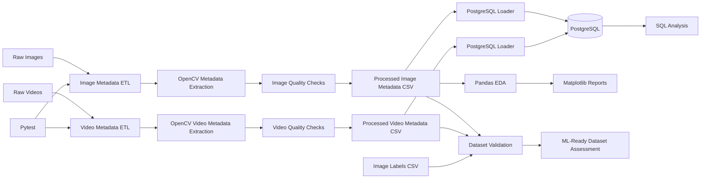

# SentinelVision

SentinelVision is an ML-ready image and video data engineering pipeline built to ingest, validate, analyse, and store media metadata for computer vision workflows.

The project demonstrates practical data engineering skills including Python ETL pipelines, OpenCV-based metadata extraction, dataset quality validation, PostgreSQL storage, SQL analysis, automated testing, and reproducible project setup.

## Architecture



## Data Pipeline

The current SentinelVision workflow is:

1. Raw images and videos are stored under `data/raw/`.
2. Python and OpenCV extract structured metadata from the media files.
3. Image quality indicators such as brightness and blur are calculated.
4. Video properties including resolution, FPS, frame count, and duration are extracted.
5. SHA-256 hashes are generated to uniquely identify media files and detect duplicates.
6. Processed metadata is written to CSV files.
7. Dataset validation checks identify corrupted files, duplicates, invalid metadata, quality issues, and incomplete labels.
8. Metadata is loaded into PostgreSQL using idempotent loaders.
9. SQL queries are used to analyse dataset quality and coverage.
10. Pandas and Matplotlib are used for exploratory data analysis and visual reporting.
11. Pytest tests validate core image and video metadata extraction behaviour.

## Project Structure

```text
sentinelvision/
├── data/
│   ├── raw/
│   │   ├── images/
│   │   └── videos/
│   ├── processed/
│   │   ├── image_metadata.csv
│   │   └── video_metadata.csv
│   └── labels/
│       └── image_labels.csv
│
├── reports/
│   └── figures/
│
├── sql/
│   ├── schema.sql
│   ├── image_quality_queries.sql
│   └── video_metadata_queries.sql
│
├── src/
│   ├── image_metadata.py
│   ├── video_metadata.py
│   ├── image_eda.py
│   ├── dataset_validation.py
│   ├── load_to_postgres.py
│   └── load_videos_to_postgres.py
│
├── tests/
│   ├── test_image_metadata.py
│   └── test_video_metadata.py
│
├── requirements.txt
└── README.md
```

## Current Capabilities

SentinelVision currently supports:

- Image metadata extraction
- Video metadata extraction
- Corrupted media detection
- SHA-256 duplicate detection
- Image brightness analysis
- Image blur detection
- Resolution and dimension validation
- Video FPS validation
- Video frame count validation
- Video duration validation
- Image label validation
- Class distribution analysis
- PostgreSQL metadata storage
- Idempotent database loading
- SQL-based dataset analysis
- Pandas-based exploratory analysis
- Matplotlib visualisations
- Automated testing with Pytest
- Reproducible PostgreSQL schema
- Reproducible Python dependencies

## Technology Stack

- Python
- OpenCV
- Pandas
- NumPy
- Matplotlib
- PostgreSQL
- SQLAlchemy
- psycopg2
- Pytest
- Git
- GitHub

## Testing

Run the complete automated test suite with:

```bash
python -m pytest tests/
```

## Database Setup

Create the required PostgreSQL tables using:

```bash
psql sentinelvision -f sql/schema.sql
```

The schema uses `CREATE TABLE IF NOT EXISTS`, allowing it to be safely rerun without replacing existing tables.

## Python Environment

Install the required Python dependencies with:

```bash
pip install -r requirements.txt
```