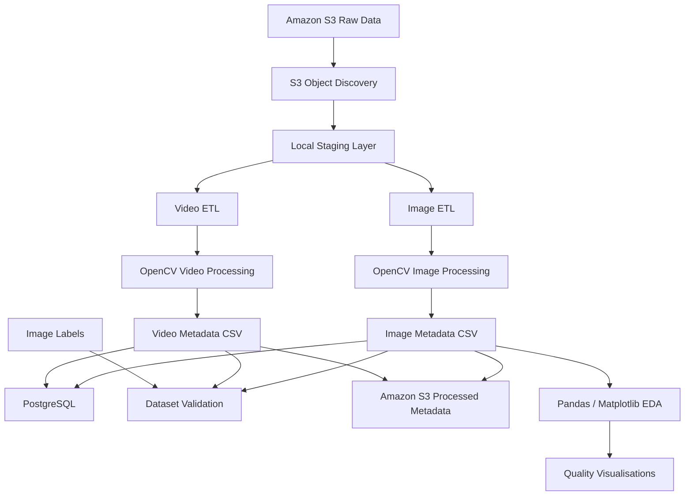

# SentinelVision

SentinelVision is an end-to-end data engineering pipeline for ingesting, processing, validating, storing, and analysing image and video datasets for computer vision and machine learning workflows.

The project demonstrates practical data engineering techniques for unstructured visual data using Python, OpenCV, Pandas, PostgreSQL, SQL, AWS S3, Boto3, Matplotlib, and Pytest.

The pipeline retrieves raw image and video files from Amazon S3, processes them locally through a staging layer, extracts technical and quality metadata, stores structured metadata in PostgreSQL, performs ML-readiness validation, and publishes refreshed metadata back to Amazon S3.

---

## Architecture



---

## End-to-End Pipeline

The main pipeline is orchestrated through:

```text
src/pipeline.py
```

Run it with:

```bash
python -m src.pipeline
```

The pipeline executes nine stages.

### Stage 1 — Amazon S3 Connectivity

Creates an authenticated Boto3 S3 client using the dedicated SentinelVision AWS CLI profile.

### Stage 2 — Raw Object Discovery

Discovers image and video objects stored under:

```text
raw/images/
raw/videos/
```

### Stage 3 — Image Ingestion

Downloads raw images from Amazon S3 into:

```text
data/staging/images/
```

### Stage 4 — Video Ingestion

Downloads raw videos from Amazon S3 into:

```text
data/staging/videos/
```

### Stage 5 — Image Metadata Extraction

OpenCV is used to extract and calculate:

- image width
- image height
- number of channels
- file size
- SHA-256 hash
- average brightness
- blur score
- corruption status
- brightness warnings
- blur warnings

Processed metadata is written to:

```text
data/processed/image_metadata.csv
```

### Stage 6 — Video Metadata Extraction

OpenCV is used to extract:

- video width
- video height
- frames per second
- frame count
- duration
- file size
- SHA-256 hash
- corruption status

Processed metadata is written to:

```text
data/processed/video_metadata.csv
```

### Stage 7 — PostgreSQL Loading

Image and video metadata are loaded into PostgreSQL.

SHA-256 hashes are used as stable content identifiers to prevent duplicate records from being inserted when the pipeline is executed repeatedly.

This makes the database loading process idempotent for previously processed media.

### Stage 8 — Dataset Validation

The validation layer checks the processed data for problems that could affect downstream machine learning workflows.

Image validation includes:

- corrupted files
- blurry images
- brightness issues
- duplicate hashes
- missing dimensions
- invalid dimensions

Video validation includes:

- corrupted files
- duplicate hashes
- missing dimensions
- invalid dimensions
- invalid FPS
- invalid frame counts
- invalid duration

Label validation includes:

- unknown labels
- missing labels
- duplicate label records
- images without corresponding labels
- class distribution

Dataset quality findings are reported separately from technical pipeline execution failures.

### Stage 9 — Processed Metadata Publication

After processing and validation, the refreshed metadata CSV files are uploaded back to Amazon S3:

```text
metadata/image_metadata.csv
metadata/video_metadata.csv
```

The pipeline verifies the uploaded objects after publication.

---

## Pipeline Flow

```text
Amazon S3
    |
    v
Raw Image / Video Discovery
    |
    v
Local Staging
    |
    +-------------------+
    |                   |
    v                   v
Image ETL           Video ETL
    |                   |
    v                   v
Image Metadata      Video Metadata
    |                   |
    +---------+---------+
              |
              v
         PostgreSQL
              |
              v
      Dataset Validation
              |
              v
   Processed Metadata to S3
```

---

## Project Structure

```text
sentinelvision/
├── README.md
├── requirements.txt
│
├── data/
│   ├── raw/
│   │   ├── images/
│   │   └── videos/
│   │
│   ├── staging/
│   │   ├── images/
│   │   └── videos/
│   │
│   ├── processed/
│   │   ├── image_metadata.csv
│   │   └── video_metadata.csv
│   │
│   └── labels/
│       └── image_labels.csv
│
├── logs/
│
├── reports/
│   └── figures/
│       ├── blur_scores.png
│       └── brightness_distribution.png
│
├── sql/
│   ├── schema.sql
│   ├── image_quality_queries.sql
│   └── video_metadata_queries.sql
│
├── src/
│   ├── pipeline.py
│   ├── s3_ingestion.py
│   ├── s3_storage.py
│   ├── image_metadata.py
│   ├── video_metadata.py
│   ├── load_to_postgres.py
│   ├── load_videos_to_postgres.py
│   ├── dataset_validation.py
│   └── image_eda.py
│
└── tests/
    ├── test_image_metadata.py
    └── test_video_metadata.py
```

Runtime staging data, raw media, logs, virtual environments, and other local artifacts are excluded from Git where appropriate.

---

## Amazon S3 Storage Design

SentinelVision separates raw media from processed metadata using S3 prefixes.

```text
sentinelvision-krishnakanth-2026/
│
├── raw/
│   ├── images/
│   └── videos/
│
└── metadata/
    ├── image_metadata.csv
    └── video_metadata.csv
```

The bucket is configured as private and is accessed through a dedicated IAM identity with bucket-specific permissions.

The project uses a separate AWS CLI profile:

```text
sentinelvision
```

AWS credentials are not stored in the repository.

---

## Image Quality Engineering

Image quality is evaluated during metadata extraction.

### Brightness

Average grayscale intensity is calculated using OpenCV.

The current project thresholds flag unusually dark or bright images while retaining the calculated brightness value for further analysis.

### Blur Detection

Blur is estimated using the variance of the Laplacian.

A lower variance generally indicates less edge detail and potentially greater blur.

The current blur threshold is a project-level heuristic and should be calibrated for the characteristics of a real production dataset rather than treated as a universal computer vision threshold.

---

## SHA-256 and Duplicate Prevention

Each image and video is assigned a SHA-256 content hash.

For example:

```text
Raw media
    |
    v
SHA-256
    |
    v
Check PostgreSQL
    |
    +---- hash exists ----> Skip insertion
    |
    +---- new hash -------> Insert metadata
```

This allows the same S3 objects to be downloaded and processed repeatedly without creating duplicate database records.

---

## PostgreSQL

SentinelVision stores structured metadata in two PostgreSQL tables:

```text
image_metadata
video_metadata
```

The database schema can be recreated using:

```bash
psql -d sentinelvision -f sql/schema.sql
```

### Image Metadata Table

Important fields include:

```text
file_path
is_corrupted
width
height
channels
file_size_bytes
sha256
brightness
blur_score
brightness_warning
blur_warning
```

### Video Metadata Table

Important fields include:

```text
file_path
is_corrupted
file_size_bytes
sha256
width
height
fps
frame_count
duration_seconds
```

The `sha256` columns are unique to provide database-level protection against duplicate content.

---

## SQL Analysis

Example SQL queries are included under:

```text
sql/
```

Image quality analysis:

```text
sql/image_quality_queries.sql
```

Video metadata analysis:

```text
sql/video_metadata_queries.sql
```

Example image-quality analysis can calculate the number and percentage of images associated with each blur-quality status.

---

## Exploratory Data Analysis

Pandas and Matplotlib are used to explore the processed image metadata.

Run:

```bash
python -m src.image_eda
```

The EDA workflow examines:

- metadata structure
- numerical distributions
- brightness status
- blur status
- image quality characteristics

Generated visualisations are stored in:

```text
reports/figures/
```

Including:

```text
brightness_distribution.png
blur_scores.png
```

---

## ML-Readiness Validation

Run dataset validation independently with:

```bash
python -m src.dataset_validation
```

The validation workflow examines both technical data integrity and basic ML dataset readiness.

The current sample dataset intentionally demonstrates that successful pipeline execution does not imply perfect dataset quality.

For example, the validation layer can identify:

- blurry imagery
- incomplete or unknown labels
- corrupted media
- duplicate files
- invalid metadata
- missing label coverage

This separation is important because a data pipeline can execute successfully while still discovering data-quality problems that require remediation before model training.

---

## Automated Testing

Pytest is used to test core metadata functionality.

Run:

```bash
python -m pytest tests/
```

The current test suite covers both image and video processing.

Tests include:

- deterministic SHA-256 hashing
- SHA-256 format validation
- comparison against Python's `hashlib`
- valid image metadata extraction
- missing image handling
- valid video metadata extraction
- missing video handling

Current suite:

```text
10 tests
```

---

## Technology Stack

| Area | Technology |
|---|---|
| Programming | Python |
| Image Processing | OpenCV |
| Video Processing | OpenCV |
| Data Manipulation | Pandas |
| Visualisation | Matplotlib |
| Database | PostgreSQL |
| Database Integration | SQLAlchemy |
| SQL | PostgreSQL SQL |
| Cloud Storage | Amazon S3 |
| AWS Integration | Boto3 |
| Authentication | AWS IAM / AWS CLI Profile |
| Data Integrity | SHA-256 |
| Testing | Pytest |
| Version Control | Git / GitHub |

---

## Installation

Clone the repository:

```bash
git clone https://github.com/Krishnakanth-21/sentinelvision.git
cd sentinelvision
```

Create a virtual environment:

```bash
python -m venv .venv
```

Activate it on macOS/Linux:

```bash
source .venv/bin/activate
```

Install dependencies:

```bash
python -m pip install -r requirements.txt
```

---

## AWS Configuration

SentinelVision expects an AWS CLI profile named:

```text
sentinelvision
```

Verify authentication with:

```bash
aws sts get-caller-identity --profile sentinelvision
```

The project does not require AWS credentials to be committed to source control.

Raw media should be stored under:

```text
raw/images/
raw/videos/
```

in the configured SentinelVision S3 bucket.

---

## PostgreSQL Setup

Ensure PostgreSQL is running:

```bash
pg_isready
```

Create the database if required:

```bash
createdb sentinelvision
```

Create the tables:

```bash
psql -d sentinelvision -f sql/schema.sql
```

---

## Running SentinelVision

Once AWS and PostgreSQL are configured, execute the complete pipeline with:

```bash
python -m src.pipeline
```

A successful technical run ends with:

```text
Pipeline execution status: PASS
SentinelVision end-to-end data pipeline completed successfully.
```

Dataset validation may still report quality findings. These findings represent problems detected in the dataset rather than necessarily indicating a technical pipeline failure.

---

## Running Individual Components

The individual components can also be executed independently.

Image metadata extraction:

```bash
python -m src.image_metadata
```

Video metadata extraction:

```bash
python -m src.video_metadata
```

Image EDA:

```bash
python -m src.image_eda
```

Image PostgreSQL loading:

```bash
python -m src.load_to_postgres
```

Video PostgreSQL loading:

```bash
python -m src.load_videos_to_postgres
```

Dataset validation:

```bash
python -m src.dataset_validation
```

S3 ingestion:

```bash
python -m src.s3_ingestion
```

S3 storage workflow:

```bash
python -m src.s3_storage
```

Full pipeline:

```bash
python -m src.pipeline
```

---

## Key Engineering Features

SentinelVision demonstrates:

- ETL processing for unstructured image and video data
- cloud-based raw media ingestion
- Amazon S3 object discovery and download
- local staging architecture
- OpenCV-based image and video metadata extraction
- image-quality analysis
- corruption detection
- SHA-256 content hashing
- idempotent PostgreSQL ingestion
- SQL-based dataset analysis
- Pandas-based exploratory data analysis
- Matplotlib visualisation
- ML-readiness validation
- label coverage and class-distribution checks
- structured logging
- exception handling
- automated testing
- reproducible Python dependencies
- reproducible PostgreSQL schemas
- processed metadata publication to Amazon S3
- Git-based source control

---

## Current Scope

SentinelVision is a portfolio-scale data engineering implementation designed to demonstrate the architecture and engineering practices involved in preparing image and video datasets for computer vision workflows.

The current dataset is intentionally small, so the project demonstrates the pipeline design rather than claiming large-scale production performance.

Potential production extensions include distributed processing, workflow scheduling, CI/CD, automated annotation systems, dataset versioning strategies, scalable object pagination, monitoring, and infrastructure-as-code.

---

## Why SentinelVision?

Computer vision systems depend on more than model architecture. Before training can begin, imagery and video need to be discovered, transferred, validated, structured, analysed, labelled, and made reproducible.

SentinelVision focuses on that data engineering layer:

```text
Raw visual data
        ↓
Reliable ingestion
        ↓
Structured metadata
        ↓
Quality validation
        ↓
Queryable storage
        ↓
ML-ready dataset preparation
```

The project demonstrates how Python, SQL, PostgreSQL, OpenCV, AWS S3, Pandas, and automated validation can be combined into a reproducible visual-data pipeline.
